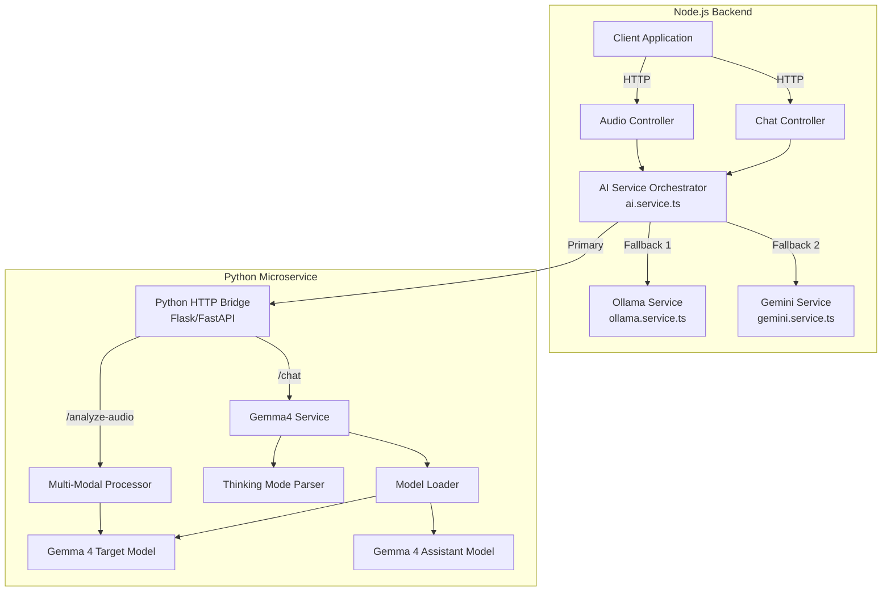

# Design Document: Gemma 4 Migration

## Overview

This design outlines the migration from Gemma 2B (via Ollama) to Gemma 4 models using the Transformers library for the GOODVIET Vietnamese pronunciation coaching platform. The migration introduces a Python-based AI service that leverages Gemma 4's advanced capabilities including thinking mode, speculative decoding, and multi-modal processing, while maintaining seamless integration with the existing Node.js/TypeScript backend.

### Key Design Goals

1. **Hybrid Architecture**: Maintain the Node.js/TypeScript backend while adding a Python microservice for Gemma 4 inference
2. **Enhanced Capabilities**: Leverage Gemma 4's thinking mode for improved response quality and multi-modal support for audio analysis
3. **Performance Optimization**: Implement speculative decoding to reduce inference latency by at least 20%
4. **Backward Compatibility**: Preserve existing AI service interfaces and fallback mechanisms
5. **Vietnamese Language Excellence**: Ensure proper handling of Vietnamese diacritical marks and language-specific phoneme patterns

### Design Rationale

The decision to use a Python-based service stems from the Transformers library's native Python implementation and superior performance compared to JavaScript alternatives. Rather than rewriting the entire backend, we introduce a lightweight Python HTTP bridge that exposes Gemma 4 functionality to the existing TypeScript services. This approach minimizes disruption while maximizing the benefits of Gemma 4's advanced features.

## Architecture

### High-Level Architecture



### Component Layers

1. **API Layer** (Node.js)
   - Express controllers handling HTTP requests
   - Request validation and authentication
   - Response formatting

2. **Service Orchestration Layer** (Node.js)
   - AI Service Orchestrator routes requests to appropriate AI provider
   - Implements fallback chain: Gemma4 → Ollama → Gemini
   - Manages conversation history and context

3. **Python Bridge Layer** (Python)
   - Flask/FastAPI HTTP server exposing REST endpoints
   - Request/response translation between Node.js and Python
   - Error handling and timeout management

4. **AI Inference Layer** (Python)
   - Gemma 4 model loading and management
   - Thinking mode processing
   - Speculative decoding coordination
   - Multi-modal input processing

### Communication Protocol

**Node.js → Python Bridge:**
- Protocol: HTTP/REST
- Port: 5000 (configurable via GEMMA4_HOST)
- Format: JSON request/response
- Timeout: 30 seconds
- Error Handling: HTTP status codes with error details

**Endpoints:**
- `GET /health` - Health check
- `POST /chat` - Chat response generation
- `POST /analyze-audio` - Audio pronunciation analysis

## Components and Interfaces

### 1. Python HTTP Bridge

**Responsibility:** Expose Python-based Gemma 4 functionality to Node.js backend via REST API.

**Interface:**

```python
# Flask/FastAPI Application
class PythonBridge:
    def __init__(self, gemma4_service: Gemma4Service):
        self.gemma4_service = gemma4_service
        
    # GET /health
    def health_check() -> HealthResponse:
        """Returns service health status"""
        return {"status": "ok", "model": model_name}
    
    # POST /chat
    def generate_chat_response(request: ChatRequest) -> ChatResponse:
        """
        Generate conversational response with thinking mode
        
        Request:
        {
            "message": str,
            "history": [{"role": str, "content": str}]
        }
        
        Response:
        {
            "response": str,
            "thinking": str | null,
            "model": str
        }
        """
        
    # POST /analyze-audio
    def analyze_audio(request: AudioAnalysisRequest) -> AudioAnalysisResponse:
        """
        Analyze pronunciation from audio recording
        
        Request:
        {
            "audio_data": str (base64),
            "mime_type": str,
            "expected_text": str
        }
        
        Response:
        {
            "overallScore": int,
            "clarityScore": int,
            "fluencyScore": int,
            "confidenceLevel": str,
            "issues": [Issue]
        }
        """
```

**Dependencies:**
- Flask or FastAPI for HTTP server
- Gemma4Service for AI inference
- CORS middleware for Node.js backend origin

**Configuration:**
- `PORT`: Server port (default: 5000)
- `ALLOWED_ORIGINS`: CORS origins (Node.js backend URL)
- `REQUEST_TIMEOUT`: Maximum request processing time (30s)

### 2. Gemma4 Service

**Responsibility:** Core AI inference using Gemma 4 models with thinking mode and speculative decoding.

**Interface:**

```python
class Gemma4Service:
    def __init__(
        self,
        model_name: str,
        assistant_model_name: str,
        device: str = "auto"
    ):
        """
        Initialize Gemma 4 service with target and assistant models
        
        Args:
            model_name: HuggingFace model ID for target model
            assistant_model_name: HuggingFace model ID for assistant model
            device: "cuda", "cpu", or "auto"
        """
        
    def generate_chat_response(
        self,
        message: str,
        history: List[Dict[str, str]],
        system_prompt: str
    ) -> Tuple[str, Optional[str]]:
        """
        Generate response with thinking mode
        
        Returns:
            Tuple of (user_facing_response, thinking_content)
        """
        
    def get_model_info(self) -> ModelInfo:
        """Return loaded model information"""
```

**Key Features:**
- Automatic device selection (CUDA if available, else CPU)
- Lazy model loading on first request
- Model warming for consistent performance
- Generation parameters: temperature=1.0, top_p=0.95, top_k=64

**Configuration:**
- `GEMMA4_TARGET_MODEL`: Target model name (e.g., "google/gemma-4-e2b")
- `GEMMA4_ASSISTANT_MODEL`: Assistant model name for speculative decoding
- `GEMMA4_DEVICE`: Force specific device ("cuda", "cpu")
- `GEMMA4_MODEL_VARIANT`: Model variant selection ("e2b", "e4b")

### 3. Thinking Mode Parser

**Responsibility:** Extract thinking content and user-facing responses from Gemma 4 outputs.

**Interface:**

```python
class ThinkingModeParser:
    @staticmethod
    def parse_response(generated_text: str) -> Tuple[str, Optional[str]]:
        """
        Parse generated text to extract thinking and response
        
        Args:
            generated_text: Raw model output potentially containing
                           <|think|>...<|/think|> tokens
        
        Returns:
            Tuple of (user_facing_response, thinking_content)
            
        Examples:
            "<|think|>reasoning<|/think|>response" -> ("response", "reasoning")
            "response without thinking" -> ("response", None)
        """
        
    @staticmethod
    def format_history_for_generation(
        history: List[Dict[str, str]]
    ) -> List[Dict[str, str]]:
        """
        Remove thinking content from assistant messages in history
        
        Args:
            history: List of {"role": str, "content": str}
        
        Returns:
            Cleaned history with thinking content removed
        """
```

**Parsing Rules:**
1. Identify `<|think|>` and `<|/think|>` token boundaries
2. Extract text between tokens as thinking content
3. Extract text after `<|/think|>` as user-facing response
4. If no thinking tokens present, treat entire output as response
5. Strip whitespace from both thinking and response

### 4. Multi-Modal Processor

**Responsibility:** Handle audio, image, and video inputs for Gemma 4 E2B/E4B variants.

**Interface:**

```python
class MultiModalProcessor:
    def __init__(self, model, model_variant: str):
        """
        Initialize processor with model and variant
        
        Args:
            model: Loaded Gemma 4 model
            model_variant: "e2b" or "e4b"
        """
        
    def analyze_audio(
        self,
        audio_data: bytes,
        mime_type: str,
        expected_text: str
    ) -> AudioAnalysis:
        """
        Analyze pronunciation from audio recording
        
        Args:
            audio_data: Raw audio bytes
            mime_type: MIME type (audio/wav, audio/mp3, audio/webm)
            expected_text: Expected Vietnamese text for comparison
        
        Returns:
            AudioAnalysis with scores and detected issues
        """
        
    def validate_input_format(
        self,
        mime_type: str
    ) -> bool:
        """Validate if MIME type is supported for current variant"""
```

**Supported Formats:**
- E2B: audio/wav, audio/mp3, audio/webm, image/*
- E4B: audio/wav, audio/mp3, audio/webm, image/*, video/*

**Audio Processing Pipeline:**
1. Convert audio bytes to base64 encoding
2. Create Vietnamese analysis prompt with expected text
3. Format multi-modal input for model
4. Generate analysis using target model
5. Parse JSON output for scores and issues
6. Return structured AudioAnalysis object

### 5. Speculative Decoding Coordinator

**Responsibility:** Coordinate target and assistant models for accelerated inference.

**Interface:**

```python
class SpeculativeDecodingCoordinator:
    def __init__(
        self,
        target_model,
        assistant_model,
        lookahead: int = 5
    ):
        """
        Initialize coordinator with models
        
        Args:
            target_model: Primary Gemma 4 model
            assistant_model: Smaller, faster assistant model
            lookahead: Number of tokens to predict speculatively
        """
        
    def generate(
        self,
        input_ids,
        attention_mask,
        generation_config
    ) -> torch.Tensor:
        """
        Generate tokens using speculative decoding
        
        Process:
        1. Assistant model predicts next K tokens
        2. Target model verifies predictions
        3. Accept matching predictions
        4. On mismatch, use target model output and continue
        5. Repeat until EOS or max length
        """
```

**Performance Targets:**
- 20% reduction in generation latency vs. target-only
- Equivalent output quality to target-only generation
- Graceful degradation if assistant model unavailable

### 6. AI Service Orchestrator (Updated)

**Responsibility:** Route AI requests to appropriate provider with fallback chain.

**TypeScript Interface:**

```typescript
class AIService {
    private provider: 'gemma4' | 'ollama' | 'gemini';
    private gemma4Client: Gemma4Client;
    
    constructor() {
        // Initialize with provider selection logic
    }
    
    async generateChatResponse(
        message: string,
        history: any[]
    ): Promise<string> {
        /**
         * Generate chat response with fallback chain:
         * 1. Try Gemma4 (if configured)
         * 2. Fallback to Ollama
         * 3. Fallback to Gemini
         * 4. Throw error if all fail
         */
    }
    
    getStatus(): ServiceStatus {
        /**
         * Return status of all AI services
         */
    }
}
```

**Provider Selection Logic:**
1. If `AI_SERVICE=gemma4`, use Gemma4 (with fallback)
2. If `AI_SERVICE=ollama`, use Ollama (with fallback)
3. If `AI_SERVICE=gemini`, use Gemini (with fallback)
4. If not set, auto-detect: try Gemma4 → Ollama → Gemini

**Configuration Updates:**
- Add `GEMMA4_HOST` environment variable (default: "http://localhost:5000")
- Add `GEMMA4_TIMEOUT` environment variable (default: 30000ms)

### 7. Gemma4 Client (New TypeScript Service)

**Responsibility:** HTTP client for communicating with Python bridge from Node.js.

**Interface:**

```typescript
class Gemma4Client {
    private baseURL: string;
    private timeout: number;
    
    constructor(host: string, timeout: number) {
        this.baseURL = host;
        this.timeout = timeout;
    }
    
    async healthCheck(): Promise<boolean> {
        /**
         * Check if Python bridge is available
         * 
         * Returns: true if healthy, false otherwise
         */
    }
    
    async generateChatResponse(
        message: string,
        history: any[]
    ): Promise<string> {
        /**
         * Generate chat response via Python bridge
         * 
         * Throws: Error if request fails or times out
         */
    }
    
    async analyzeAudio(
        audioBuffer: Buffer,
        mimeType: string,
        expectedText: string
    ): Promise<AudioAnalysis> {
        /**
         * Analyze pronunciation via Python bridge
         * 
         * Throws: Error if request fails or times out
         */
    }
}
```

**Error Handling:**
- Network errors: Throw with message "Gemma4 service unavailable"
- Timeout: Throw with message "Gemma4 request timeout"
- HTTP 4xx/5xx: Throw with server error message
- Retry logic: No automatic retries (handled by orchestrator fallback)

## Data Models

### Python Models

```python
from dataclasses import dataclass
from typing import List, Optional, Literal

@dataclass
class ChatMessage:
    """Single message in conversation history"""
    role: Literal["system", "user", "assistant"]
    content: str

@dataclass
class ChatRequest:
    """Request for chat response generation"""
    message: str
    history: List[ChatMessage]

@dataclass
class ChatResponse:
    """Response from chat generation"""
    response: str
    thinking: Optional[str]
    model: str

@dataclass
class AudioAnalysisRequest:
    """Request for audio pronunciation analysis"""
    audio_data: str  # base64 encoded
    mime_type: str
    expected_text: str

@dataclass
class PronunciationIssue:
    """Single pronunciation issue detected"""
    phoneme: Literal["L/N", "TR/CH", "S/X"]
    severity: Literal["mild", "moderate", "severe"]
    description: str
    detected_word: str
    expected_word: str

@dataclass
class AudioAnalysis:
    """Audio pronunciation analysis result"""
    overall_score: int  # 0-100
    clarity_score: int  # 0-100
    fluency_score: int  # 0-100
    confidence_level: Literal["high", "medium", "low"]
    issues: List[PronunciationIssue]

@dataclass
class ModelInfo:
    """Information about loaded model"""
    target_model: str
    assistant_model: str
    device: str
    variant: str

@dataclass
class HealthResponse:
    """Health check response"""
    status: Literal["ok", "degraded", "error"]
    model: str
    device: str
```

### TypeScript Models

```typescript
// Extend existing conversation history types
interface ChatMessage {
    senderType: 'user' | 'assistant' | 'system';
    content: string;
    timestamp?: Date;
}

// New types for Gemma4 integration
interface Gemma4Config {
    host: string;
    timeout: number;
    enabled: boolean;
}

interface AudioAnalysis {
    overallScore: number;
    clarityScore: number;
    fluencyScore: number;
    confidenceLevel: 'high' | 'medium' | 'low';
    issues: PronunciationIssue[];
}

interface PronunciationIssue {
    phoneme: 'L/N' | 'TR/CH' | 'S/X';
    severity: 'mild' | 'moderate' | 'severe';
    description: string;
    detectedWord: string;
    expectedWord: string;
}

interface ServiceStatus {
    provider: 'gemma4' | 'ollama' | 'gemini';
    gemma4: boolean;
    ollama: boolean;
    gemini: boolean;
}
```

### Environment Configuration

**Node.js (.env):**
```
# Existing variables
PORT=3000
MONGODB_URI=mongodb://localhost:27017/goodviet
JWT_SECRET=your_jwt_secret_here
GEMINI_API_KEY=your_gemini_key_here

# New Gemma4 configuration
AI_SERVICE=gemma4
GEMMA4_HOST=http://localhost:5000
GEMMA4_TIMEOUT=30000
```

**Python (.env):**
```
# Python bridge configuration
PORT=5000
ALLOWED_ORIGINS=http://localhost:3000

# Model configuration
GEMMA4_TARGET_MODEL=google/gemma-4-e2b
GEMMA4_ASSISTANT_MODEL=google/gemma-4-1b
GEMMA4_DEVICE=auto
GEMMA4_MODEL_VARIANT=e2b

# Generation parameters
TEMPERATURE=1.0
TOP_P=0.95
TOP_K=64
MAX_NEW_TOKENS=300
```

## Error Handling

### Error Classification

1. **Configuration Errors**
   - Missing environment variables
   - Invalid model names
   - Unreachable host URLs
   - **Handling:** Fail fast on startup with clear error messages

2. **Model Loading Errors**
   - Model not found on HuggingFace
   - Insufficient memory for model
   - CUDA not available when required
   - **Handling:** Log error, attempt CPU fallback, raise exception if all fail

3. **Request Errors**
   - Invalid input format
   - Missing required fields
   - Audio format not supported
   - **Handling:** Return HTTP 400 with validation error details

4. **Inference Errors**
   - Model generation timeout
   - Out of memory during inference
   - Model outputs invalid format
   - **Handling:** Return HTTP 500, log error, trigger fallback in orchestrator

5. **Network Errors**
   - Python bridge unreachable
   - Request timeout
   - Connection refused
   - **Handling:** Log error, trigger fallback chain in orchestrator

### Error Response Format

**Python Bridge:**
```json
{
    "error": "Error message",
    "type": "ValidationError | InferenceError | TimeoutError",
    "details": "Additional context"
}
```

**HTTP Status Codes:**
- 200: Success
- 400: Invalid request (validation error)
- 408: Request timeout
- 500: Server error (model error, inference error)
- 503: Service unavailable (model not loaded)

### Fallback Chain

```
Request → Gemma4 Service
    ↓ (on error)
Ollama Service
    ↓ (on error)
Gemini Service
    ↓ (on error)
Error: "All AI services unavailable"
```

**Logging:** Each fallback attempt logs provider name and error reason.

### Vietnamese Language Error Messages

```python
ERROR_MESSAGES = {
    "model_not_loaded": "Mô hình AI chưa được tải. Vui lòng thử lại sau.",
    "audio_format_invalid": "Định dạng âm thanh không hợp lệ. Chỉ hỗ trợ WAV, MP3, WEBM.",
    "generation_failed": "Không thể tạo phản hồi. Vui lòng thử lại.",
    "service_unavailable": "Dịch vụ AI tạm thời không khả dụng."
}
```

