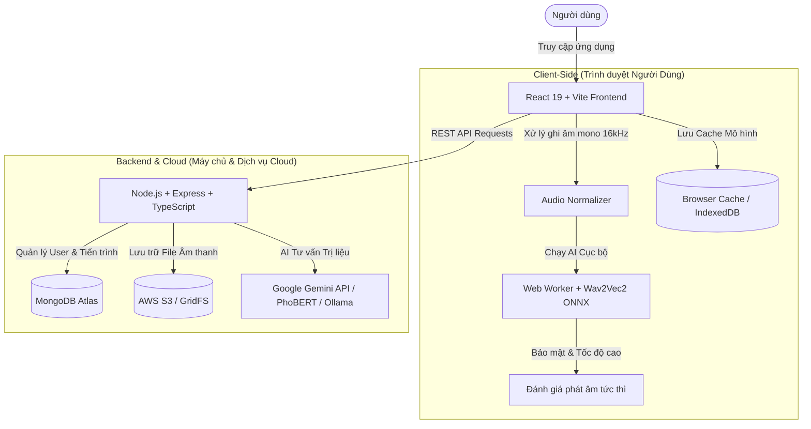

# 🚀 Hành Trình Tạo Nên Nền Tảng GoodViet (How GoodViet Was Built)

Tài liệu này giải thích chi tiết cách thức nền tảng **GoodViet** (Hệ thống Hỗ trợ Âm ngữ Trị liệu cho người Việt) được thiết kế, xây dựng kiến trúc và phát triển từ ý tưởng ban đầu đến sản phẩm hoàn chỉnh.

---

## 1. 💡 Ý Tưởng & Mục Tiêu Dự Án (Idea & Objectives)

- **Bài toán đặt ra**: Người gặp khó khăn về phát âm hoặc điều trị ngôn ngữ tại Việt Nam thiếu các công cụ luyện tập cá nhân hóa, dễ tiếp cận, phản hồi tức thì và chi phí hợp lý.
- **Giải pháp**: Xây dựng nền tảng Web thông minh kết hợp AI:
  - **Đánh giá phát âm cục bộ**: Nhận diện âm thanh ngay trên trình duyệt mà không cần gửi dữ liệu thoại lên máy chủ (bảo mật & phản hồi tức thì).
  - **Trợ lý AI Trị liệu**: Chatbot tư vấn bài tập, phương pháp âm ngữ trị liệu phù hợp.
  - **Theo dõi tiến trình**: Ghi nhận và thống kê quá trình luyện tập chuyên sâu cho người dùng và chuyên gia.

---

## 2. 🎨 Thiết Kế Giao Diện & Trải Nghiệm (UI/UX Design)

- **Nguyên mẫu UI/UX**: Giao diện ban đầu được phác thảo và thiết kế trên **Figma** (tham khảo mẫu thiết kế tại [`figma-design.png`](file:///d:/Goodviet_proj/GoodViet/GoodViet/figma-design.png)).
- **Tiêu chuẩn thiết kế (Design System)**:
  - Giao diện thân thiện, hiện đại, phối màu tươi sáng tạo cảm giác thoải mái cho người luyện tập.
  - Tích hợp hệ thống biểu đồ trực quan (Recharts) giúp theo dõi sự tiến bộ qua thời gian.
  - Tương thích tốt trên nhiều thiết bị (Responsive Web Design) với Tailwind CSS.
  - Sử dụng bộ icon chuẩn từ `lucide-react`.

---

## 3. 🏗️ Kiến Trúc Hệ Thống (System Architecture)

GoodViet áp dụng mô hình **Client-Server kết hợp Hybrid Edge AI**:



---

## 4. 🛠️ Công Nghệ & Công Cụ Sử Dụng (Tech Stack)

### 💻 Frontend (Client-Side)
- **Framework Core**: React 19, TypeScript, Vite.
- **Styling**: Tailwind CSS v4, PostCSS, Lucide React Icons.
- **State Management**: Zustand (Quản lý state toàn cục: Chat store, Auth store, Audio state).
- **Routing**: React Router DOM v7.
- **AI Engine trên trình duyệt**:
  - `@huggingface/transformers` kết hợp **Web Workers**.
  - Mô hình **Wav2Vec2 CTC** chuẩn hóa dạng ONNX chạy trên WebGPU/WebAssembly.
  - Dữ liệu thoại được xử lý trực tiếp tại máy tính/điện thoại người dùng, đảm bảo tính riêng tư cao nhất.
- **Hiển thị dữ liệu & Markdown**: Recharts, `react-markdown`, `rehype-katex`, `remark-gfm`.

### ⚙️ Backend (Server-Side)
- **Runtime & Framework**: Node.js, Express.js (TypeScript).
- **Database**: MongoDB Atlas (với Mongoose ODM).
- **Xác thực & Bảo mật**: JWT (JSON Web Token), Bcrypt, Helmet, Express Rate Limit, CORS.
- **Quản lý & Lưu trữ File**: AWS S3 (`@aws-sdk/client-s3`, `multer-s3`) kết hợp MongoDB GridFS dự phòng.
- **Tích hợp Mô hình AI Backend**:
  - Google Generative AI (`@google/generative-ai` / Gemini API).
  - Phân luồng Chatbot với **PhoBERT** & **Ollama** (chạy LLM local).
  - Validation dữ liệu đầu vào bằng `zod`.

---

## 5. 🔄 Quy Trình Phát Triển Chi Tiết (Step-by-Step Creation)

Làm sao ứng dụng GoodViet được hoàn thiện:

1. **Bước 1: Phân tích Nhu cầu & Thiết kế Giao diện**:
   - Nghiên cứu phương pháp âm ngữ trị liệu tiếng Việt.
   - Thiết kế nguyên mẫu UI trên Figma với đầy đủ các màn hình: Trang chủ, Đánh giá phát âm (`/assessment`), Chatbot (`/chat`), Thống kê (`/dashboard`), Luyện tập (`/practice`).

2. **Bước 2: Xây dựng AI Đánh giá Phát âm trên Trình duyệt**:
   - Chuyển đổi mô hình Wav2Vec2 tiếng Việt sang định dạng ONNX (xem [`tools/voice-model/README.md`](file:///d:/Goodviet_proj/GoodViet/GoodViet/tools/voice-model/README.md)).
   - Viết Web Worker trong React (`src/workers/speechModel.worker.ts`) để nạp model ONNX, xử lý tín hiệu âm thanh (AudioContext, Mono 16kHz) và trả về kết quả phiên âm/đánh giá.

3. **Bước 3: Phát triển Backend API & Cơ sở Dữ liệu**:
   - Xây dựng mô hình dữ liệu Mongoose (`User`, `Assessment`, `AudioRecord`, `PracticeSession`).
   - Viết các Controller & Service xử lý Auth, lưu trữ file âm thanh lên AWS S3 và giao tiếp với Google Gemini AI.

4. **Bước 4: Tích hợp Frontend - Backend & Trợ lý Chatbot**:
   - Kết nối React Frontend với Express Backend qua các API Services.
   - Xây dựng Chatbot AI hỗ trợ giải đáp thắc mắc âm ngữ trị liệu, tích hợp PhoBERT / Gemini API.
   - Quản lý trạng thái ứng dụng bằng Zustand store.

5. **Bước 5: Kiểm thử, Tối ưu & Triển khai**:
   - Tối ưu bộ nhớ khi load model AI bằng cách lưu vào Browser Cache / IndexedDB.
   - Viết unit tests & integration tests (Sử dụng Vitest cho Frontend và Jest cho Backend).
   - Triển khai Frontend lên Vercel và Backend lên Cloud Server.

---

## 6. 🚀 Hướng Dẫn Chạy Dự Án Cục Bộ (Quick Start)

Muốn chạy thử dự án trên máy tính cá nhân? Hãy làm theo các bước sau:

### 1. Thư mục Frontend (Root)
```bash
# Cài đặt dependencies
npm install

# Khởi chạy dev server (Chạy tại http://localhost:5173)
npm run dev
```

### 2. Thư mục Backend
```bash
cd backend

# Cài đặt dependencies
npm install

# Khởi chạy Backend server (Chạy tại http://localhost:5000)
npm run dev
```

> **Lưu ý**: Đảm bảo bạn đã sao chép `.env.example` thành `.env` và điền đầy đủ các thông số kết nối (MONGODB_URI, GEMINI_API_KEY, v.v.).

---

## 🔗 Tài Liệu Liên Quan
- [`README.md`](file:///d:/Goodviet_proj/GoodViet/GoodViet/README.md): Hướng dẫn nhanh dự án.
- [`DEVELOPMENT_GUIDE.md`](file:///d:/Goodviet_proj/GoodViet/GoodViet/DEVELOPMENT_GUIDE.md): Quy chuẩn lập trình và cấu trúc mã nguồn.
- [`tools/voice-model/README.md`](file:///d:/Goodviet_proj/GoodViet/GoodViet/tools/voice-model/README.md): Hướng dẫn xuất và đóng gói mô hình AI nhận diện giọng nói.
